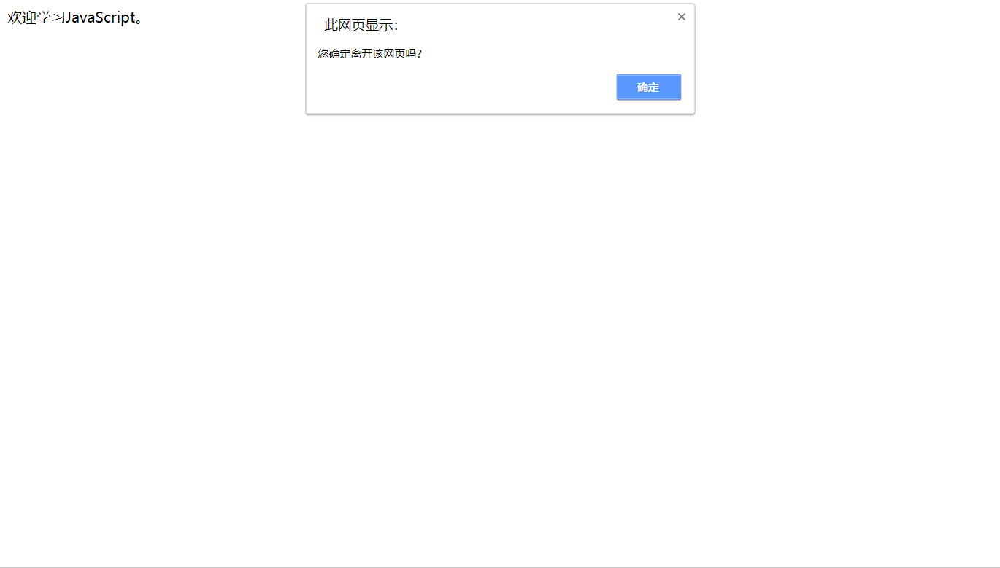
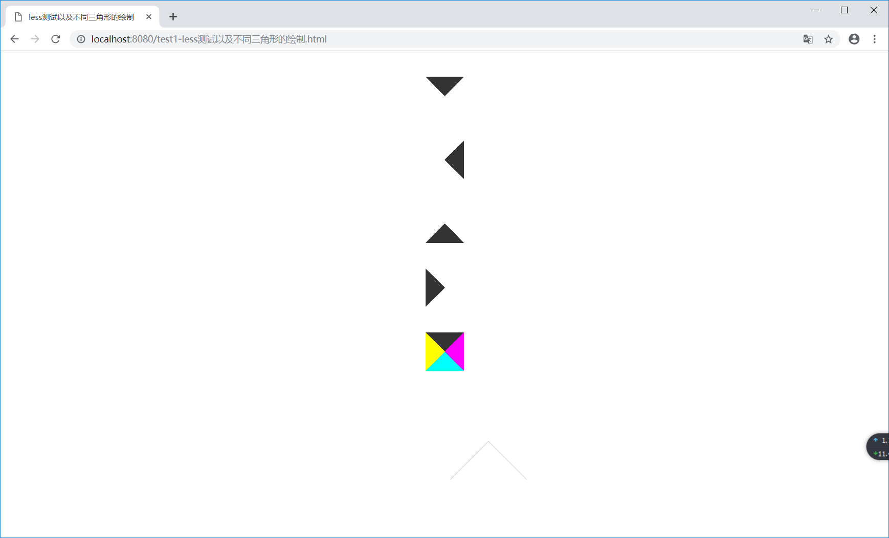
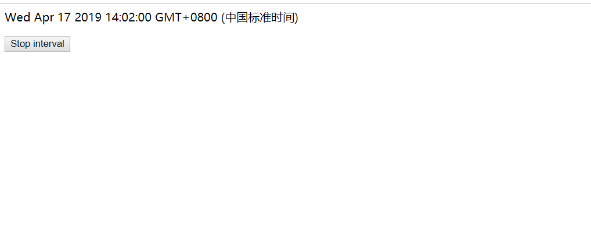
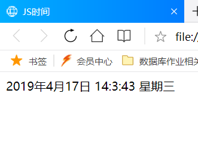
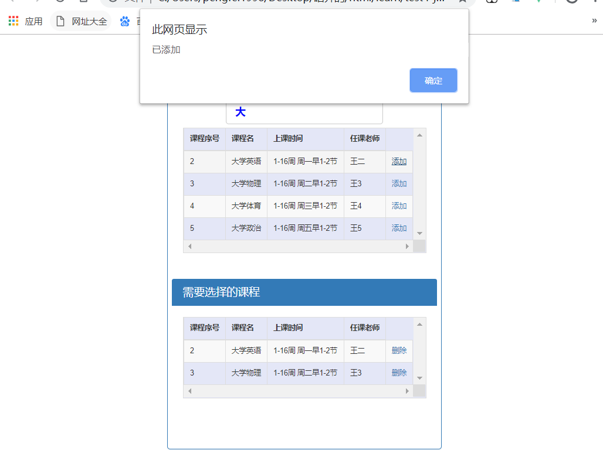
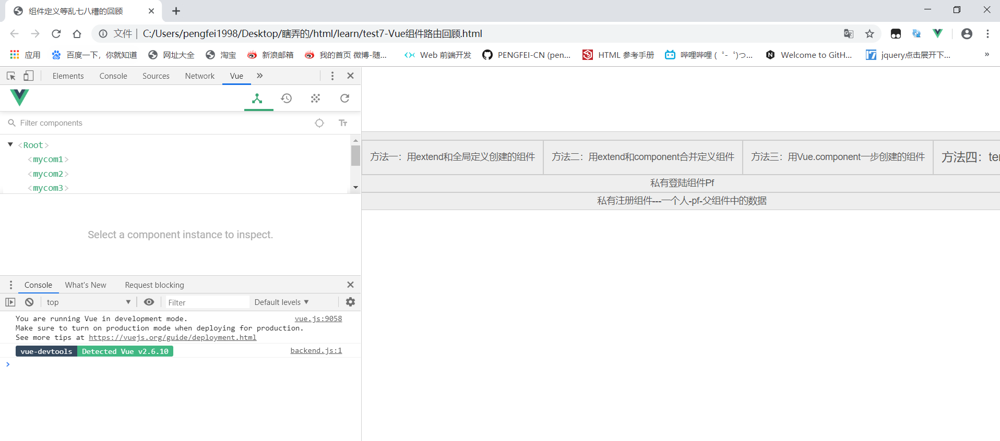
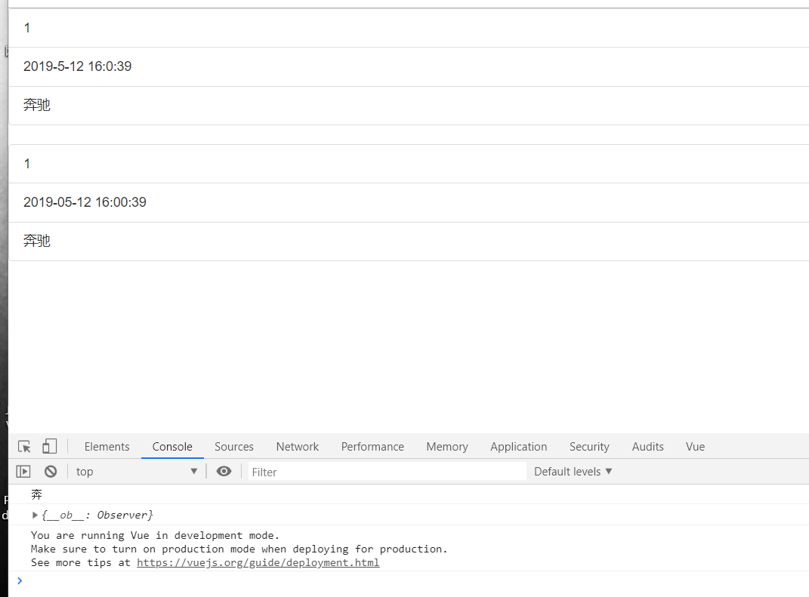
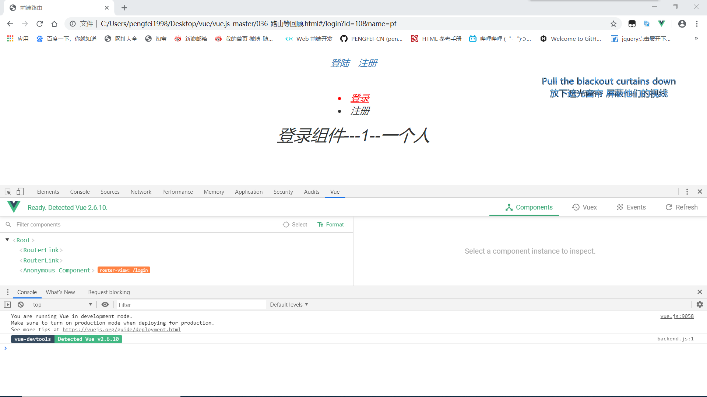
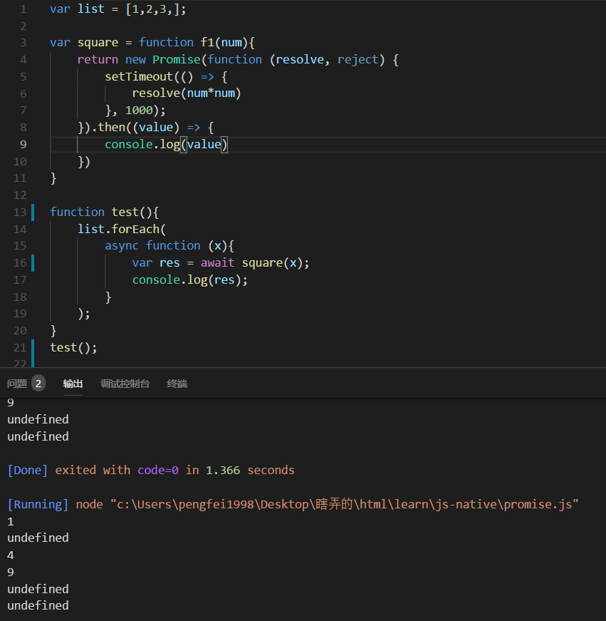
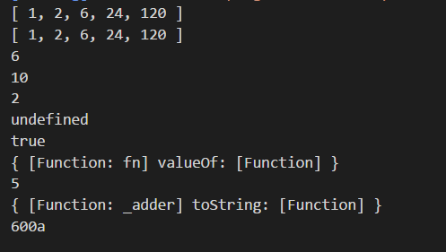

# 练习代码

    -练习时候的文件，顺便最近学习vue和复习js、准备实习面试的代码一起上传了；
    -代码内容如文件名；

## 说明

    -就当学习中的一些笔记
    -额，在github上放图片加载好像是个很蠢的行为但是谁让我懒呢。。
    -前端入门中~学无止境

## 目标

    -慕课网js深入浅出看完的同时跟随练习
    -黑马vue教程看完的同时同步练习
    -面试题目得练习
    -以上，加油！！！习惯成自然！

## 目录

    0. test1-less测试以及不同三角形的绘制.html  

    1. test1-less测试以及不同三角形的绘制.html  

    2. test2-时间显示.html  

    3. test3-时间的自定义显示.html  

    4. test4-js数组遍历.html

    5. test5-Vue数据绑定实现.html

    6. test6-脚本互相依赖执行顺序.html

    7. test7-Vue组件路由回顾.html

    8. test8-筛选过滤数据的实现.html

    9. test9-Vue路由等回顾.html

    10. test10-js面试题练习.html
    10.1-Promise和async,await语句的联合使用；
    10.2-柯里化，arguments的使用，实现sum(100,200)(300)();得到600a；

    
    

